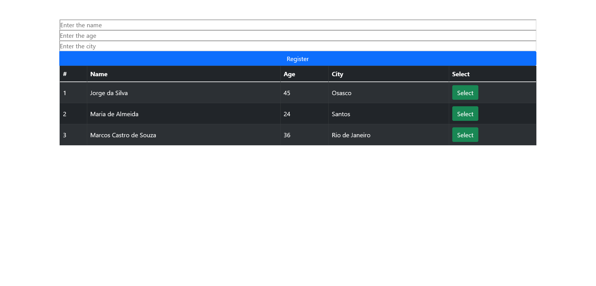

# Simple CRUD System using React

## Overview

### Screenshot

### Links

-   Solution URL: https://react-crud-app-livid.vercel.app/

## My process

### Built with

-   Semantic HTML5 markup
-   CSS
-   Bootstrap
-   JavaScript
-   React JS

### Installation

-   `npm install`

### To run

-   `npm start`

### What I learned

In this project i could use React to create and use components in the project, providing dynamic information to be printed in the page.

## Author

-   GitHub - Vinícius dos Santos Verissimo (https://github.com/viniciusdsv93)
